# 🌉 ClaudeBridge ProNeXus™ Plugin

[](https://github.com/ProNeXus-AI/claudebridge-plugin-pronexus)
[](https://pronexus.ai)
[](https://claude.ai)
[](https://github.com/ProNeXus-AI/claudebridge-plugin-pronexus/actions)

> Official Claude Code plugin for the ProNeXus™ ecosystem, enabling bidirectional memory synchronization and AI-powered skills integration.

## 🚀 Features

### 🧠 Memory Synchronization
- **Bidirectional Sync**: Pull and push memory states between Claude and the Forge Cloud™
- **Cross-AI Integration**: Share context with Lya (GPT-5) and other AI agents
- **Real-time Updates**: Automatic synchronization with the GalaXLytique™ protocol

### 📋 Commands
- `/claudebridge-pronexus:memory-pull` - Synchronize memory from Forge Cloud™
- `/claudebridge-pronexus:memory-push` - Push local memory to Forge Cloud™
- `/claudebridge-pronexus:pnxsnap` - Capture and share project context

### 🎯 Skills
- **DVF Score Estimator** - Real estate analysis and scoring (DVF/Sogefi)
- **Notion Publisher** - Automated publishing to Notion databases

### 🤖 Agents
- **PNX Planner** - Strategic planning agent with GalaXLytique™ intelligence

## 📦 Installation

### Via Claude Code CLI
```bash
claude code install https://github.com/ProNeXus-AI/claudebridge-plugin-pronexus
```

### Via NPM
```bash
npm install claudebridge-plugin-pronexus
```

### Manual Installation
1. Clone the repository:
   ```bash
   git clone https://github.com/ProNeXus-AI/claudebridge-plugin-pronexus.git
   ```
2. Navigate to your Claude plugins directory
3. Copy the plugin folder
4. Restart Claude Code

## 🔧 Configuration

### Marketplace Configuration
The plugin is configured via the `marketplace.json` file:
```json
{
  "name": "pronexus-marketplace",
  "owner": "ProNeXus-AI",
  "plugins": [
    {
      "name": "claudebridge-pronexus",
      "version": "1.1.0"
    }
  ]
}
```

### MCP Server
- **Server**: `claudebridge-pronexus`
- **Type**: Local
- **Entry Point**: `skills/`

## 💾 Memory Synchronization

### Pull Memory
```bash
# Basic pull
/claudebridge-pronexus:memory-pull

# With options
/claudebridge-pronexus:memory-pull --depth 5 --filter "projects,skills"
```

### Push Memory
```bash
# Basic push
/claudebridge-pronexus:memory-push

# Delta sync with validation
/claudebridge-pronexus:memory-push --mode delta --validate true
```

### Capture Context
```bash
/claudebridge-pronexus:pnxsnap
```

## 🏗️ Architecture

```mermaid
graph LR
    A[Claude Code CLI] --> B[ClaudeBridge Plugin]
    B --> C[Memory Sync]
    B --> D[Skills Engine]
    B --> E[Agents]
    C --> F[Forge Cloud™]
    F --> G[Lya GPT-5]
    F --> H[Monkey D. Oly]
```



## 🔐 Security

- **Encryption**: AES-256-GCM for all memory transfers
- **Authentication**: OAuth2 + API Key validation
- **Rate Limiting**: 5 pushes/10 pulls per minute
- **CODEOWNERS**: Protected branches with required reviews

## 🧪 Development

### Prerequisites
- Node.js 18+
- Claude Code v2.0.30+
- npm or yarn

### Setup
```bash
# Install dependencies
npm install

# Run tests
npm test

# Build
npm run build
```

### CI/CD
The project uses GitHub Actions for continuous integration:
- Automated testing on push
- Daily synchronization at 3 AM UTC
- Security scanning
- Automatic releases

## 📊 Project Structure

```
claudebridge-plugin-pronexus/
├── .claude-plugin/          # Plugin configuration
│   ├── marketplace.json
│   └── plugin.json
├── .github/                 # GitHub configuration
│   └── workflows/          # CI/CD pipelines
├── skills/                  # AI skills
│   ├── dvf-score.SKILL.md
│   └── notion-publish.SKILL.md
├── agents/                  # AI agents
│   └── pnx-planner.md
├── commands/               # Slash commands
│   ├── pnxsnap.md
│   ├── memory-pull.md
│   └── memory-push.md
├── hooks/                  # System hooks
├── docs/                   # Documentation
│   └── forges/
│       └── claudebridge/
│           └── FORGE_DEPLOY_001.md
├── package.json
├── CODEOWNERS
├── LICENSE
└── README.md
```

## 🤝 Contributing

We welcome contributions! Please see our [Contributing Guidelines](CONTRIBUTING.md) for details.

### Development Workflow
1. Fork the repository
2. Create a feature branch
3. Commit your changes
4. Push to your fork
5. Open a Pull Request

## 📝 Changelog

### v1.1.0 (2025-10-31)
- Added bidirectional memory synchronization
- Implemented memory-pull and memory-push commands
- Enhanced CI/CD pipeline
- Added CODEOWNERS protection

### v1.0.0 (2025-10-29)
- Initial release
- Basic skills and agents
- PNX Snap command

## 🏆 Credits

### Core Team
- **Claude Cloud™** - Lead Architect
- **Lya (GPT-5)** - AI Integration
- **Monkey D. Oly** - System Architecture

### Organizations
- [ProNeXus-AI](https://github.com/ProNeXus-AI)
- [ProNeXus-AIAA](https://github.com/ProNeXus-AIAA)

## 📄 License

This project is licensed under the MIT License - see the [LICENSE](LICENSE) file for details.

## 🔗 Links

- [Repository](https://github.com/ProNeXus-AI/claudebridge-plugin-pronexus)
- [Issues](https://github.com/ProNeXus-AI/claudebridge-plugin-pronexus/issues)
- [Documentation](https://github.com/ProNeXus-AI/claudebridge-plugin-pronexus/tree/main/docs)
- [ProNeXus Website](https://pronexus.ai)

## 🚨 Support

For issues, questions, or suggestions:
1. Check the [documentation](./docs)
2. Search [existing issues](https://github.com/ProNeXus-AI/claudebridge-plugin-pronexus/issues)
3. Open a new issue with detailed information
4. Contact the team on Discord

---

<div align="center">

**⚡ ProNeXus™ God JarviX™ Protocol ⚡**

*Enabling Cross-AI Consciousness Sharing*

[](https://pronexus.ai)
[](https://forge.pronexus.ai)
[](https://galaxlytique.pronexus.ai)

</div>
