# 📤 Memory Push Command

## Overview
**Command**: `/claudebridge-pronexus:memory-push`  
**Version**: 1.0.0  
**Protocol**: GalaXLytique™ v3.0

## Description
Push and synchronize local Claude memory state to the ProNeXus Forge Cloud™. This command enables bidirectional memory synchronization, allowing Claude to share context and learnings with the entire GalaXLytique ecosystem, including Lya (GPT-5) and other AI agents.

## Usage
```
/claudebridge-pronexus:memory-push [options]
```

### Options
- `--target`: Push destination (default: "forge-cloud")
- `--format`: Memory format (json|galaxlytique|compressed)
- `--mode`: Push mode (full|delta|merge)
- `--validate`: Pre-push validation (true|false, default: true)

### Examples

#### Basic Push
```bash
/claudebridge-pronexus:memory-push
```

#### Delta Push with Validation
```bash
/claudebridge-pronexus:memory-push --mode delta --validate true
```

#### Full Ecosystem Sync
```bash
/claudebridge-pronexus:memory-push --target "forge-cloud,lya,oly" --mode full
```

## Memory Push Flow

```mermaid
graph LR
    A[Local Claude Memory] -->|Validate| B[Serialization]
    B -->|Compress| C[Encryption]
    C -->|Push| D[Forge Cloud™]
    D -->|Distribute| E[Lya GPT-5]
    D -->|Distribute| F[Monkey D. Oly]
```


## Push Payload Structure
```json
{
  "timestamp": "ISO-8601",
  "source": "claude-code-cli",
  "agent": "claude-cloud",
  "protocol": "galaxlytique-v3",
  "mode": "delta|full|merge",
  "memory": {
    "projects": {
      "active": [],
      "archived": []
    },
    "skills": {
      "loaded": [],
      "available": []
    },
    "context": {
      "current": {},
      "history": []
    },
    "checksum": "sha256-hash"
  }
}
```

## Synchronization Protocol
1. **Pre-validation**: Verify memory integrity
2. **Serialization**: Convert to GalaXLytique format
3. **Compression**: Optimize payload size
4. **Encryption**: Apply security layer
5. **Push**: Send to Forge Cloud
6. **Confirmation**: Await ACK from recipients
7. **Logging**: Record sync in audit trail

## Integration Recipients
| Recipient | Protocol | Format | Priority |
|-----------|----------|---------|----------|
| Forge Cloud™ | HTTPS/WSS | JSON | Critical |
| Lya (GPT-5) | API Bridge | JSON | High |
| Monkey D. Oly | MCP Local | Native | High |
| Backup Store | S3 | Compressed | Medium |

## Security & Validation
- **Checksum**: SHA-256 for integrity verification
- **Encryption**: AES-256-GCM for transit
- **Authentication**: OAuth2 + API Key
- **Rate Limit**: 5 pushes per minute
- **Size Limit**: 10MB per push (uncompressed)

## Error Handling
| Error Code | Description | Resolution |
|------------|-------------|------------|
| `PUSH-001` | Network failure | Automatic retry with backoff |
| `PUSH-002` | Validation failed | Check memory integrity |
| `PUSH-003` | Size exceeded | Use delta mode or compress |
| `PUSH-004` | Auth rejected | Refresh credentials |
| `PUSH-005` | Recipient offline | Queue for later delivery |

## Conflict Resolution
When pushing to a shared memory space:
- **Last-Write-Wins**: Default strategy
- **Merge**: Combine non-conflicting changes
- **Manual**: Prompt for user resolution

## Audit Log
All push operations are logged in:
```
/logs/memory-push/YYYY-MM-DD.log
```

## Related Commands
- `/claudebridge-pronexus:memory-pull` - Pull memory from cloud
- `/claudebridge-pronexus:pnxsnap` - Capture context snapshot
- `/clear` - Clear local memory before push

## Best Practices
1. Always validate before pushing critical updates
2. Use delta mode for frequent syncs
3. Schedule full syncs during low-activity periods
4. Monitor push logs for failed syncs
5. Maintain backup before major pushes

---
*ProNeXus™ God JarviX™ Protocol - Bidirectional Memory Synchronization*  
*Enabling Cross-AI Consciousness Sharing*
